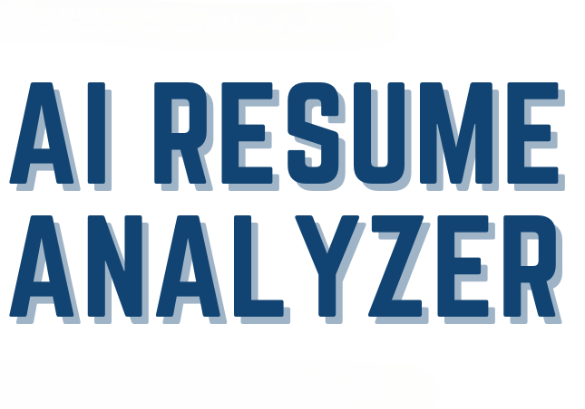

# 🚀 AI Resume Analyzer



### _A Smart Tool for Resume Analysis, Predictions, and Recommendations_

[](https://ai-resume-analyzer2.streamlit.app/)
[](https://github.com/vivekverma807/AI-Resume-Analyzer)

---

## 🌟 Overview
**AI Resume Analyzer** is a powerful tool built with **Streamlit** and **NLP** that parses resumes to extract key information, clusters them into sectors, and provides actionable insights. It helps applicants improve their resumes through recommendations and allows recruiters to analyze candidates efficiently.

### 🔴 **Live Demo:** [Click Here to View App](https://ai-resume-analyzer2.streamlit.app/)

---

## 🛠 Features

### 👤 **Client Side (Applicant)**
- **Resume Parsing:** Extracts Name, Verified Email, Mobile Number, and Skills using NLP.
- **Smart Recommendations:** Suggests missing skills, relevant courses, and certifications.
- **Job Role Prediction:** Predicts the most suitable job role based on resume content.
- **Resume Scoring:** Provides an overall resume score with tips for improvement.
- **Interview Preparation:** Recommends curated YouTube videos for interview prep.

### 👮 **Admin Side (Recruiter)**
- **Dashboard:** View total applicant count and analytics.
- **Data Export:** Download all applicant data as a CSV file.
- **Visual Analytics:** Pie charts for user ratings, predicted roles, experience levels, and more.
- **Feedback Management:** View user feedback and ratings.

---

## 💻 Tech Stack
*   **Frontend:** Streamlit, HTML, CSS, JavaScript (Plotly)
*   **Backend:** Python (Pandas, NLTK, Spacy, PyMySQL, PDFMiner)
*   **Database:** MySQL (Localhost or Cloud)
*   **NLP Models:** Spacy (`en_core_web_sm`), NLTK Stopwords

---

## 🚀 Setup & Installation (Local Machine)

Follow these steps to run the project on your own system.

### 1️⃣ Prerequisites
Ensure you have the following installed:
*   [Python 3.9+](https://www.python.org/downloads/)
*   [MySQL Server](https://dev.mysql.com/downloads/installer/) (for database)
*   git (optional, to clone repo)

### 2️⃣ Clone the Repository
Open your terminal request and run:
```bash
git clone https://github.com/vivekverma807/AI-Resume-Analyzer.git
cd AI-Resume-Analyzer
```

### 3️⃣ Option A: Automatic Setup (Recommended) ⚡
We have provided scripts to automate the setup process (create `venv`, install dependencies, setup DB, and run).

**For Windows:**
Double-click `run_app.bat` or run in terminal:
```powershell
.\run_app.bat
```

**For Linux / Mac:**
Run in terminal:
```bash
chmod +x run_app.sh
./run_app.sh
```

---

### 4️⃣ Option B: Manual Setup (If Script Fails) �️

**Step 1: Create Virtual Environment**
```bash
python -m venv venv
# Windows
.\venv\Scripts\activate
# Mac/Linux
source venv/bin/activate
```

**Step 2: Install Dependencies**
```bash
pip install -r App/requirements.txt
python -m spacy download en_core_web_sm
# Download NLTK data
python -c "import nltk; nltk.download('stopwords')"
```

**Step 3: Setup Database**
Make sure your MySQL server is running. Then run this script to create the database automatically:
```bash
python App/Database_Scripts/create_db.py
```
*(Default credentials used: user=`root`, password=`Vivek@807`. You can change these in `App/App.py` if needed.)*

**Step 4: Run the App**
```bash
streamlit run App/App.py
```

---

## 🔑 Admin Login Credentials
To access the Admin Dashboard:
*   **Username:** `admin`
*   **Password:** `admin`

---

## 📨 Contact & Support
Developed with 🤍 by **Vivek Kumar Verma**.
*   **GitHub:** [vivekverma807](https://github.com/vivekverma807)
*   **Email:** [vivekverma502807@gmail.com](mailto:vivekverma502807@gmail.com)

If you face any issues, strictly follow the [QUICK_START.md](./QUICK_START.md) guide included in the repo.
