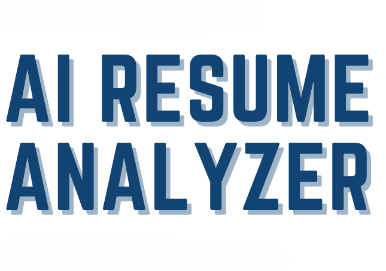

# 🚀 AI Resume Analyzer



### _Intelligent Resume Parsing & Career Recommendation System with NLP & Machine Learning_

[](https://ai-resume-analyzer2.streamlit.app/)
[](https://github.com/vivekverma807/AI-Resume-Analyzer)
[](https://www.python.org/)
[](https://streamlit.io/)

---

## 🌟 Overview

**AI Resume Analyzer** is an end-to-end intelligent resume screening and analysis platform that leverages **Natural Language Processing (NLP)**, **Named Entity Recognition (NER)**, and **Machine Learning** to automate resume evaluation. The system extracts key information from resumes, predicts job roles, provides personalized skill recommendations, and offers detailed analytics for both job seekers and recruiters.

**Built with Streamlit** for an interactive web interface, this tool helps:
- **Job Seekers:** Improve resumes with AI-driven recommendations, skill gap analysis, and interview preparation resources
- **Recruiters:** Streamline candidate screening, analyze applicant data, and make data-driven hiring decisions

**Cloud Architecture:** The live deployment uses **TiDB Cloud** as the database backend, enabling seamless data persistence and admin access from anywhere. All applicant data is securely stored in the cloud, allowing recruiters to access the dashboard remotely.

### 🔴 **Live Demo:** [https://ai-resume-analyzer2.streamlit.app/](https://ai-resume-analyzer2.streamlit.app/)

---

## 🎯 Key Features

### 👤 **Applicant Module**
- **📄 Smart Resume Parsing:** Automatically extracts structured data from PDF/DOCX resumes
  - Name, Email, Phone Number (with validation)
  - Skills using NLP (Spacy NER + Custom Matcher)
  - Education Level & Degree
  - Total Years of Experience
  - Page Count Analysis
  
- **🎓 Job Role Prediction:** AI predicts suitable career paths across 24+ job categories:
  - Data Science, Web Development, Android/iOS Development
  - UI/UX Design, Database Administration, Network Security
  - And more technical/non-technical roles

- **⭐ Resume Scoring System:** 
  - Objective score (0-100) based on completeness and quality
  - Detailed feedback on missing sections
  - Tips to improve ATS (Applicant Tracking System) compatibility

- **💡 Personalized Recommendations:**
  - Skill gap analysis with suggested skills to learn
  - Course recommendations (Udemy, Coursera, edX links)
  - Certification suggestions based on career path
  - YouTube video playlists for interview preparation

- **📊 User Analytics Tracking:**
  - Timestamp & location logging (IP-based geolocation)
  - Device & platform detection
  - Resume upload history

### 👮 **Admin/Recruiter Dashboard**
- **📈 Analytics & Insights:**
  - Total applicants count with real-time statistics
  - Interactive visualizations (Pie charts, Bar graphs using Plotly)
  - Distribution analysis: User ratings, predicted roles, experience levels
  - Resume score distribution
  - Skill frequency analysis across candidates

- **📥 Data Management:**
  - Export all applicant data to CSV
  - View detailed candidate profiles
  - Feedback and rating management
  - Database operations (view, clear, backup)

- **🔐 Secure Admin Access:** Username/password authentication

- **☁️ Cloud-Based Access:** 
  - Data stored in TiDB Cloud for production deployment
  - Access admin dashboard from anywhere via Streamlit Cloud
  - Real-time synchronization across all deployments

---

## 💻 Technology Stack

### **Frontend**
- **Streamlit** - Web application framework
- **HTML/CSS** - Custom styling
- **Plotly** - Interactive data visualizations
- **Streamlit-Tags** - Tag input components

### **Backend & Processing**
- **Python 3.11+** - Core programming language
- **Pandas** - Data manipulation and analysis
- **PyMySQL** - MySQL/TiDB database connectivity
- **PDFMiner3** - PDF text extraction
- **docx2txt** - Word document parsing
- **GeoPy & Geocoder** - Location services

### **Natural Language Processing**
- **Spacy 3.8** - NLP pipeline and NER
  - `en_core_web_sm` - Pre-trained English model
  - Custom Matcher for skill extraction
- **NLTK** - Text preprocessing and stopwords removal

### **Database**
- **MySQL (Local)** - For local development and testing
- **TiDB Cloud** - Cloud-native database for production deployment
  - Enables remote data access for Streamlit cloud deployment
  - Admin dashboard accessible from anywhere
  - Stores all application data:
    - User data and resume information
    - Skills, experience, and predictions
    - Admin feedback and ratings
    - Analytics and metadata

### **Additional Libraries**
- **Pillow** - Image processing
- **Cryptography** - Secure password handling
- **Requests** - HTTP requests
- **RateLim** - API rate limiting

---

## 📁 Project Structure

```
AI-Resume-Analyzer/
├── App/
│   ├── App.py                      # Main Streamlit application
│   ├── Courses.py                  # Pre-loaded course recommendations
│   ├── requirements.txt            # Python dependencies
│   ├── Logo/                       # Application logos and images
│   ├── Database_Scripts/           # Database setup and management
│   │   ├── create_db.py           # Auto-creates MySQL database
│   │   ├── view_db.py             # View database contents
│   │   ├── clear_db.py            # Clear database
│   │   └── setup_cloud_db.py      # Cloud database configuration
│   └── .streamlit/                 # Streamlit configuration
├── pyresparser/                    # Custom resume parsing module
│   ├── resume_parser.py           # Core parsing logic
│   ├── utils.py                   # NLP utility functions
│   └── constants.py               # Skill databases and patterns
├── screenshots/                    # Application screenshots
├── run_app.bat                     # Windows launcher script
├── run_app.sh                      # Linux/Mac launcher script
├── requirements.txt                # Root dependencies
├── README.md                       # This file
└── QUICK_START.md                  # Quick setup guide
```

---

## 🚀 Installation & Setup

### 📋 Prerequisites
- **Python 3.11+** ([Download here](https://www.python.org/downloads/))
- **MySQL Server 8.0+** ([Download here](https://dev.mysql.com/downloads/installer/))
- **Git** (optional, for cloning)

### ⚡ Quick Start (Recommended)

**Windows Users:**
1. Install Python and MySQL (set root password as `Vivek@807`)
2. Double-click `run_app.bat` file
3. Script will automatically:
   - Create virtual environment
   - Install dependencies
   - Download NLP models
   - Setup database
   - Launch application

**Linux/Mac Users:**
```bash
chmod +x run_app.sh
./run_app.sh
```

The app will automatically open at `http://localhost:8501`

---

### 🛠 Manual Installation

If automatic setup fails, follow these steps:

**1. Clone Repository**
```bash
git clone https://github.com/vivekverma807/AI-Resume-Analyzer.git
cd AI-Resume-Analyzer
```

**2. Create Virtual Environment**
```bash
# Windows
python -m venv venv
.\venv\Scripts\activate

# Linux/Mac
python3 -m venv venv
source venv/bin/activate
```

**3. Install Dependencies**
```bash
pip install -r requirements.txt
python -m spacy download en_core_web_sm
python -c "import nltk; nltk.download('stopwords')"
```

**4. Configure Database**

Start MySQL server and update credentials in `App/App.py` (lines ~120-125) if needed:
```python
connection = pymysql.connect(
    host='localhost',
    user='root',
    password='YOUR_PASSWORD'  # Change if different
)
```

**5. Create Database**
```bash
python App/Database_Scripts/create_db.py
```

This creates the `cv` database with tables:
- `user_data` - Applicant information
- `feedback` - User ratings and comments

**6. Run Application**
```bash
streamlit run App/App.py
```

---

## 🔐 Admin Access

To access the recruiter dashboard:
- **Username:** `admin`
- **Password:** `admin`

*(For production, change credentials in `App/App.py`)*

---

## ☁️ Cloud Deployment

### **Live Production Setup**

The application is deployed on **Streamlit Cloud** with **TiDB Cloud** as the database backend:

**Architecture:**
- **Frontend:** Streamlit Community Cloud (Free hosting)
- **Database:** TiDB Cloud (MySQL-compatible cloud database)
- **Benefits:**
  - 24/7 availability with no server maintenance
  - Admin can access dashboard from anywhere
  - All applicant data persists in cloud storage
  - Automatic scaling and backups
  - Secure SSL/TLS connections

**Why TiDB Cloud?**
- Fully managed MySQL-compatible database
- No infrastructure management required
- Seamless integration with PyMySQL
- Free tier available for small projects
- Global accessibility for admin users

**Accessing Admin Dashboard on Cloud:**
1. Visit: [https://ai-resume-analyzer2.streamlit.app/](https://ai-resume-analyzer2.streamlit.app/)
2. Navigate to "Admin" section in sidebar
3. Login with admin credentials
4. View all applicant data stored in TiDB Cloud
5. Export or analyze data in real-time

---

## 📊 How It Works

### **For Job Seekers:**
1. **Upload Resume** (PDF/DOCX format)
2. **AI Analysis** - System extracts:
   - Personal information (Name, Email, Phone)
   - Skills using NLP
   - Education details
   - Experience level
3. **Get Predictions** - Job role recommendation
4. **Receive Feedback:**
   - Resume score (0-100)
   - Skill recommendations
   - Course suggestions
   - Interview prep videos
5. **Improve & Resubmit**

### **For Recruiters:**
1. **Login to Admin Panel**
2. **View Analytics:**
   - Total applications
   - Role distribution
   - Skill trends
   - Score statistics
3. **Export Data** - Download CSV for further analysis
4. **Make Informed Decisions** - Data-driven hiring

---

## 🎨 Screenshots

Check the `/screenshots` folder for application previews showing:
- Resume upload interface
- Prediction results
- Recommendations panel
- Admin dashboard
- Analytics visualizations

---

## 🔧 Configuration

### Database Settings

**For Local Development (MySQL):**
Edit `App/App.py` to change database credentials:
```python
host='localhost'      # MySQL host
user='root'           # MySQL username  
password='Vivek@807'  # MySQL password
database='cv'         # Database name
```

**For Cloud Deployment (TiDB Cloud):**
The production app uses TiDB Cloud for remote data storage:
- Configured in `App/Database_Scripts/setup_cloud_db.py`
- Enables admin dashboard access on Streamlit Cloud deployment
- All applicant data stored securely in the cloud
- Compatible with MySQL protocol (seamless integration)

To set up TiDB Cloud:
1. Create account at [TiDB Cloud](https://tidbcloud.com/)
2. Create a cluster and get connection details
3. Update connection settings in `App/App.py` with TiDB credentials
4. Run `python App/Database_Scripts/setup_cloud_db.py` to initialize tables

### NLP Models
- Spacy model: `en_core_web_sm` (automatically downloaded)
- NLTK data: `stopwords` corpus (auto-downloaded on first run)

---

## 🐛 Troubleshooting

| Issue | Solution |
|-------|----------|
| **MySQL Connection Error** | Ensure MySQL service is running. Check credentials in `App.py` |
| **Spacy Model Not Found** | Run: `python -m spacy download en_core_web_sm` |
| **NLTK Data Missing** | Run: `python -c "import nltk; nltk.download('stopwords')"` |
| **Port Already in Use** | Change port: `streamlit run App/App.py --server.port 8502` |
| **PDF Parsing Error** | Ensure resume is not password-protected or corrupted |
| **Database Table Error** | Run `python App/Database_Scripts/create_db.py` to recreate tables |

For detailed troubleshooting, see [QUICK_START.md](./QUICK_START.md)

---

## 📈 Future Enhancements

- [ ] Multi-language resume support
- [ ] ATS score improvement suggestions
- [ ] Resume template generator
- [ ] Skill endorsement system
- [ ] Interview scheduling integration
- [ ] Batch resume processing
- [ ] REST API for integration
- [ ] Resume comparison tool

---

## 🤝 Contributing

Contributions are welcome! Please:
1. Fork the repository
2. Create a feature branch (`git checkout -b feature/AmazingFeature`)
3. Commit changes (`git commit -m 'Add AmazingFeature'`)
4. Push to branch (`git push origin feature/AmazingFeature`)
5. Open a Pull Request

---

## 📄 License

This project is licensed under the MIT License - see the [LICENSE](LICENSE) file for details.

---

## 📨 Contact & Support

**Developed with ❤️ by Vivek Kumar Verma**

- **GitHub:** [@vivekverma807](https://github.com/vivekverma807)
- **Email:** [vivekverma502807@gmail.com](mailto:vivekverma502807@gmail.com)
- **LinkedIn:** [Connect with me](https://www.linkedin.com/in/vivekverma807)

### Support
- ⭐ Star this repository if you find it helpful
- 🐛 Report bugs via [GitHub Issues](https://github.com/vivekverma807/AI-Resume-Analyzer/issues)
- 💡 Suggest features or improvements
- 📖 Check [QUICK_START.md](./QUICK_START.md) for detailed setup guide

---

## 🙏 Acknowledgments

- **Spacy** for NLP capabilities
- **Streamlit** for the web framework
- **PyResParser** library contributors
- Open-source community

---

**⚡ Try it now:** [Live Demo](https://ai-resume-analyzer2.streamlit.app/)

Made with 🤍 and ☕ in India
